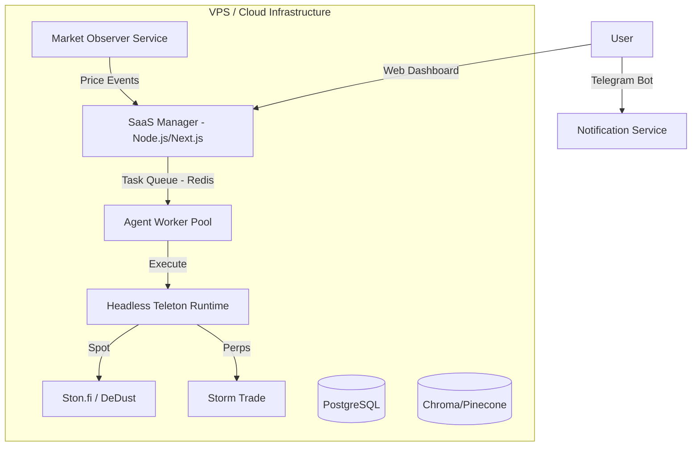

# Headless Teleton Agent: DeFAI Hedge Fund on TON
## Product Requirements & Technical Architecture Document

This document outlines the strategy for transforming the **teleton-agent** codebase into a scalable, multi-tenant SaaS platform for automated DeFi trading on the TON blockchain.

---

## 1. Product Requirements Document (PRD)

### **Product Vision**
**Headless Teleton Agent** is an autonomous AI Hedge Fund on TON.
 It allows users to delegate capital to "DeFAI" agents that monitor markets and execute sophisticated trading strategies (Spot & Perps) 24/7.

### **Core Value Proposition**
1.  **Institutional-Grade Logic:** AI agents calculate organic APY, hedge with perpetuals (Storm Trade), and avoid high-risk/rug signals.
2.  **Non-Custodial Trust:** Users retain ownership via **TON Wallet V5 Delegation**, granting the agent a specific "Trading Allowance" without sharing seed phrases.
3.  **Set & Forget:** Automated portfolio rebalancing based on user-defined risk profiles.

### **User Personas**
*   **The Yield Farmer:** Seeks stable, high APY on USDT/TON pairs with auto-rebalancing.
*   **The Speculator:** Targets meme coin volatility with AI-managed entry/exit points.
*   **The Busy Professional:** Wants hands-off exposure to the TON ecosystem with active risk management.

### **User Stories**

#### **Epic 1: Onboarding & Strategy Selection**
*   **Story:** As a user, I want to connect my TON wallet and browse strategies like "Meme Hunter" or "Stable Yield."
*   **Story:** As a user, I want to deploy an agent by signing a transaction that grants a 500 TON trading allowance.

#### **Epic 2: Headless Agent Operation**
*   **Story:** As a user, I want my agent to execute a Storm Trade "Short" to hedge my spot position if market volatility spikes.
*   **Story:** As a user, I want my agent to automatically exit a pool if the APR drops below a specific threshold.

#### **Epic 3: Notifications & Management**
*   **Story:** As a user, I want to receive "Trade Executed" notifications via a dedicated Telegram Bot.
*   **Story:** As a user, I want to use the `/status` command in Telegram to see my real-time PnL.

---

## 2. Technical Architecture Plan (SaaS Migration)

### **System Overview**
To scale on a single VPS, we shift from a "Chat-First" (one bot per user) to an **"Event-Driven Worker Pool"** architecture.

### **Component Breakdown**

1.  **The Manager (SaaS Backend):** Orchestrates user accounts, handles billing (via Telegram Stars/TON), and dispatches jobs to workers.
2.  **Market Observer (The Trigger):** A single service watching TonAPI/Storm Trade WebSockets. It sends signals to the Manager, which then "wakes up" relevant agents.
3.  **Headless Worker Pool:** A refactored version of the Teleton Runtime that is stateless, runs a single "thought-action" cycle from an injected JSON config, and exits.
4.  **Notification Bot:** A lightweight bot service (Telegraf) that notifies users of agent actions.

---

## 3. Teleton Codebase Adaptation Strategy

| Component | Required SaaS Change |
| :--- | :--- |
| **Config Loader** | **Refactor:** Create an adapter to accept JSON config passed via Environment Variables or API. |
| **Wallet Service** | **Refactor:** Modify `loadWallet()` to accept an injected mnemonic or Wallet V5 instance from memory. |
| **Telegram Bridge** | **Replace:** Replace `gramjs` (User Client) with a lightweight Bot API for proactive notifications. |
| **Memory System** | **Migrate:** Move from local SQLite (`memory.db`) to a multi-tenant PostgreSQL/Vector database. |
| **New Plugin** | **Implement:** Build `src/agent/tools/storm` for perpetuals (Long/Short/Hedge). |
| **Entry Point** | **New:** Create `src/worker.ts` – a serverless-style handler for one-off agent executions. |

---

## 4. Security & Trust Model

*   **Wallet V5 Delegation:** The agent address is granted a "spending allowance" for specific smart contracts (DEX routers). If the SaaS is compromised, the attacker cannot withdraw funds to an external wallet; they can only trade within the allowed routers.
*   **In-Memory Keys:** Keys are injected into the worker process memory only for the duration of the trade execution and are never persisted to the worker's local disk.

---

## 5. Next Steps

1.  **Phase 1:** Implement the **Storm Trade Plugin** (`src/agent/tools/storm`).
2.  **Phase 2:** Create the **Headless Worker Entry Point** (`src/worker.ts`).
3.  **Phase 3:** Refactor **WalletService** for dependency injection (multi-wallet support).
4.  **Phase 4:** Build the **SaaS Manager API** to orchestrate agent deployments.
